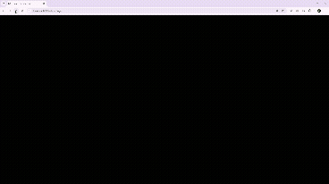
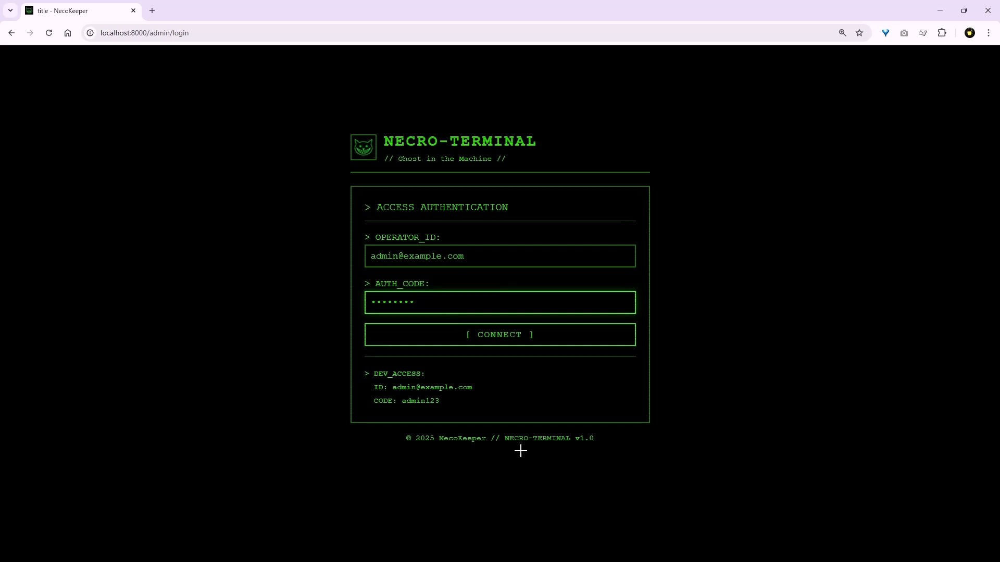
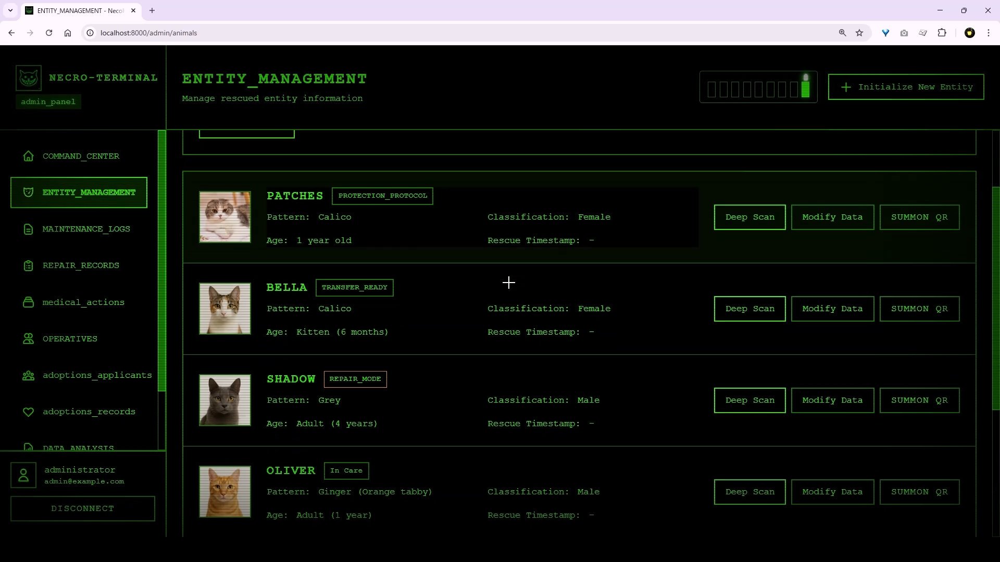

# 🐾 NecoKeeper
### **AI Workflow for Real Cat Rescue Operations**

NecoKeeper digitizes handwritten daily care logs and veterinary notes used in cat rescue shelters.
Volunteers continue using paper; the system extracts the data with AI, stores structured records, and provides QR-based access for each cat.

Built with **FastAPI**, **OCR**, **SQL**, **Docker**, and optional automation through **AWS Kiro (MCP)**.

---

## 🌟 Key Features

- **AI extraction of handwritten care logs**
  – Upload an image of a handwritten sheet → JSON → stored automatically.

- **Per-cat QR-code profiles**
  – One tap to access daily logs, medical actions, adoption status, and weight trends.

- **Centralized admin panel for shelters**
  – Manage cats, care logs, medical records, volunteers, and adoption applicants.

- **Reporting & trends**
  – View care history, weight progression, medical timelines.

- **MCP/Kiro Integration (optional)**
  – Use AWS Kiro AI IDE to trigger automated workflows such as OCR → API registration.

- **Lightweight & deployable**
  – FastAPI + SQLite; easy to run locally or on cloud services such as Render.

---

## 🎬 Demo Video
👉 **https://youtu.be/K5GZoW2HnA0**
A 3-minute walkthrough showing AI-driven workflow and shelter operations.

---

## 🌐 Live Demo
👉 **https://necokeeper.onrender.com/**
(Login credentials for reviewers provided on Devpost)

---

## 📘 Problem

Cat rescue shelters—especially volunteer-run organizations—still rely heavily on:

- handwritten care logs
- veterinary notes on paper
- inconsistent spreadsheet transfers
- fragmented information across multiple tools

This results in duplicated work, missing data, and difficulty understanding each cat’s condition.

---

## 💡 Solution

NecoKeeper keeps the workflow natural for volunteers:

1. Volunteers **write by hand** as usual (paper log sheet).
2. NecoKeeper reads the sheet image using **AI OCR + parsing**.
3. Extracted data is automatically **converted to structured JSON**.
4. The API stores logs, medical notes, and metadata per cat.
5. A **QR code** on each cage opens the cat’s up-to-date profile instantly.

This preserves existing workflows while enabling digital transformation without stress.

---

## 🛠️ Tech Stack

| Layer | Technology |
|------|------------|
| API | FastAPI, Python |
| DB | SQLite (local / Render disk) |
| OCR | PaddleOCR / Vision Model |
| UI | TailwindCSS, Jinja Templates |
| Deployment | Docker, Render |
| AI IDE Integration | AWS Kiro + MCP (optional) |

---

## 📂 Project Structure (Simplified)

```
NecoKeeper/
├── app/                 # FastAPI app
│   ├── api/             # Endpoints
│   ├── core/            # Config, settings
│   ├── models/          # SQLAlchemy models
│   ├── services/        # Business logic
│   └── templates/       # Admin UI
├── data/                # Local SQLite database
├── static/              # CSS, assets
└── scripts/             # OCR, MCP hooks
```

---

## 🚀 Local Setup (Developer Use)

```
uv venv
source .venv/bin/activate
uv pip install -r requirements.txt
uvicorn app.main:app --reload
```

Database for local use:

```
DATABASE_URL=sqlite:///./data/necokeeper.db
```

(Production on Render uses a persistent disk at `/mnt/data`.)

---

## 🔧 Environment Variables (Required Minimum)

```
# Core
DATABASE_URL=sqlite:///./data/necokeeper.db

# Media directories
MEDIA_DIR=./media
BACKUP_DIR=./backups
LOG_FILE=./logs/necokeeper.log

# Enable/disable Kiroween Mode
KIROWEEN_MODE=false
```

---

# 🎃 Kiroween Mode – Bonus Halloween Themed UI

NecoKeeper includes a special **Kiroween Mode**, created exclusively for the AWS Kiroween Hackathon.
It transforms the admin interface into a retro green CRT terminal theme called **NECRO-TERMINAL**.

This mode highlights creativity, theming, and AI-assisted UI customization.

---

## 🔧 Enable Kiroween Mode

Use an environment variable:

```env
KIROWEEN_MODE=true
```

When enabled:

- "NECRO-TERMINAL" login screen
- CRT-style UI for all admin pages
- Themed buttons, labels, and entity panels
- Bonus animations & terminal aesthetics

Disable to return to the standard UI.

---

## 🎞 Animated Preview



*Switching from normal UI to NECRO-TERMINAL theme*

---

## 🖼 Screenshots

### Login Screen


*NECRO-TERMINAL themed login interface*

### Entity Management


*CRT-style admin dashboard with retro terminal aesthetics*

---

## 📄 License
MIT License.

---

## 🐱 Acknowledgements

This project was built for the **AWS Kiroween Hackathon** to support real cat rescue operations and demonstrate AI-powered workflow automation.
